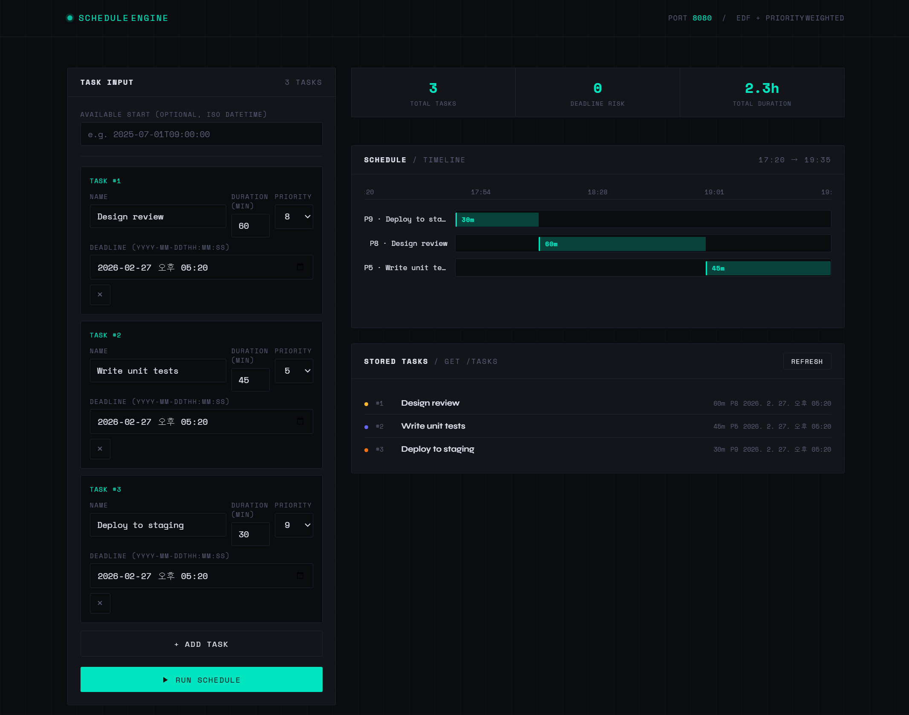

# schedule-engine

C++ 기반 스마트 일정 최적화 서버 — REST API + 브라우저 대시보드



## Overview

EDF(Earliest Deadline First) 알고리즘에 우선순위 가중치를 결합한 태스크 스케줄링 엔진입니다.  
마감일과 중요도를 함께 고려해 최적의 작업 순서를 계산하고, 브라우저 대시보드에서 Gantt 차트로 시각화합니다.

## Features

- **EDF + Priority Weight 스케줄링** — 마감일 + 중요도를 동시에 고려한 최적 순서 계산
- **Gantt 차트 시각화** — 브라우저에서 타임라인 직접 확인
- **Deadline 초과 경고** — 마감일을 넘기는 태스크 자동 감지 및 시각적 경고
- **태스크 관리** — 동적 추가/삭제, 실행 시 저장 목록 자동 갱신
- **단일 실행파일 배포** — exe 하나로 API 서버 + 대시보드 UI 동시 서빙

## Tech Stack

| 항목 | 내용 |
|------|------|
| Language | C++17 |
| Framework | [Crow](https://github.com/CrowCpp/Crow) |
| Network | Asio 1.28.0 (standalone) |
| Build | CMake |
| Compiler | MSVC (Visual Studio 2022) |
| OS | Windows 10 |

## Algorithm

### EDF + Priority Weight Scheduling

단순 EDF는 마감일만 보지만, 이 엔진은 **우선순위 가중치**를 추가로 반영합니다.

```
score = deadline - (priority × 3600)
```

score가 낮을수록 먼저 처리됩니다. 마감일이 같다면 priority가 높은 태스크가 앞으로 당겨집니다.

## Getting Started

### 1. Clone

```bash
git clone https://github.com/bhj2837/schedule-engine.git
cd schedule-engine
```

### 2. Build

```bash
cmake -S . -B build
cmake --build build --config Release
```

### 3. Run

```bash
./build/Release/schedule-engine.exe
```

브라우저에서 `http://localhost:8080` 접속

## API

### `GET /`
서버 상태 확인

---

### `GET /tasks`
저장된 태스크 목록 반환

**Response**
```json
{
  "status": "ok",
  "count": 2,
  "tasks": [
    {
      "id": 1,
      "name": "Deploy to staging",
      "duration_min": 30,
      "priority": 9,
      "deadline": 1751360400
    }
  ]
}
```

---

### `POST /schedule`
태스크 목록을 입력받아 최적 스케줄 계산 후 저장

**Request**
```json
{
  "available_start": 1751349600,
  "tasks": [
    {
      "id": 1,
      "name": "Deploy to staging",
      "duration": 30,
      "priority": 9,
      "deadline": "2025-07-01T18:00:00"
    },
    {
      "id": 2,
      "name": "Write unit tests",
      "duration": 60,
      "priority": 5,
      "deadline": "2025-07-01T17:00:00"
    }
  ]
}
```

| 필드 | 타입 | 필수 | 설명 |
|------|------|------|------|
| `tasks` | array | ✅ | 태스크 목록 |
| `available_start` | unix timestamp | ❌ | 시작 가능 시각 (기본값: 현재 시각) |
| `name` | string | ✅ | 태스크 이름 |
| `duration` | integer | ✅ | 소요 시간 (분, 양수) |
| `priority` | integer | ✅ | 우선순위 (1–10) |
| `deadline` | string | ✅ | 마감일 (`YYYY-MM-DDTHH:MM:SS`) |

**Response**
```json
{
  "status": "ok",
  "count": 2,
  "schedule": [
    {
      "id": 1,
      "title": "Deploy to staging",
      "priority": 9,
      "duration_min": 30,
      "start_time": 1751349600,
      "end_time": 1751351400
    }
  ]
}
```

## Project Structure

```
schedule-engine/
├── .github/
│   └── workflows/
│       └── build.yml       # GitHub Actions CI
├── src/
│   ├── main.cpp            # 서버 라우팅
│   ├── scheduler.cpp       # 스케줄링 알고리즘
│   └── scheduler.h         # Task, TaskStore, Scheduler 정의
├── include/
│   ├── crow_all.h
│   ├── asio.hpp
│   └── asio/
├── dashboard.html          # 브라우저 대시보드 UI
└── CMakeLists.txt
```

## CI

GitHub Actions로 `main` 브랜치 push/PR 시 Windows 환경에서 자동 빌드됩니다.

[](https://github.com/bhj2837/schedule-engine/actions/workflows/build.yml)
